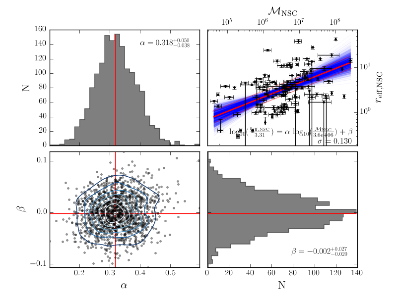

Fitting a straight line with non-symmetric uncertainties
========================================================

This repository is an exercise I had with `Iskren Georgiev`_ when he was
looking at linear correlations between the stellar mass of galaxies and the
properties of their central nuclear star cluster.

The approach here is neither frequentist nor Bayesian but more like in between.
We explored how to quickly get fits through his data even when the uncertainties
were non-symmetric or upper limits.

The full mcmc approach is also included in the repository.

.. _Iskren Georgiev: http://www.mpia.de/homes/georgiev/

Full documentation: http://mfouesneau.github.io/docs/fitline/

Example usage
-------------

.. code:: python

        python btmcfit.py reff_NSC_Mass_late.dat -o reff_NSC_Mass_late_samp.dat \
                -N 1500 -n 1 --xfloor 10 --yfloor 10 --sigma_samp 0 \
                --x12label '${\cal M}_{\rm NSC}$' \
                --y12label '$r_{\rm eff,NSC}$' \
                --xnorm 6.314 --ynorm .40

Command line details
--------------------

Options are all available from the command line and from the (optional)
configuration file.

Options
~~~~~~~

**fitting options**

+-------------------------+-------------------------------------------------------------+
|  -n, --nsamp            |  number of samples to represent per data point uncertainties|
+-------------------------+-------------------------------------------------------------+
|  -N, --nboot            |  number of bootstrap realization                            |
+-------------------------+-------------------------------------------------------------+
|  --xnorm                |  x-data normalization value                                 |
+-------------------------+-------------------------------------------------------------+
|  --ynorm                |  y-data normalization value                                 |
+-------------------------+-------------------------------------------------------------+
|  --xfloor               |  floor of x-value uncertainty (in %)                        |
+-------------------------+-------------------------------------------------------------+
|  --yfloor               |  floor of y-value uncertainty (in %)                        |
+-------------------------+-------------------------------------------------------------+
|  -o OUTPUT, --output    |  export the samples into a file                             |
+-------------------------+-------------------------------------------------------------+

**plotting options**

+------------------------+------------------------------------------------------------------------+
|  -f, --savefig         |   Generate figures with the desired format (pdf, png...)               |
+------------------------+------------------------------------------------------------------------+
|  --sigma_samp          |   number of samplings to represent the intrinsic dispersion of the plot|
+------------------------+------------------------------------------------------------------------+
|  --x12label=X12LABEL   |   X-label of the top-right plot (it can be in latex form)              |
+------------------------+------------------------------------------------------------------------+
|  --y12label=Y12LABEL   |   Y-label of the top-right plot (it can be in latex form)              |
+------------------------+------------------------------------------------------------------------+
                                                                                                 
**special options**                                                                             

+------------------------+------------------------------------------------------------------------+
|  -c, --config          |   Configuration file to use for default values (see below for details) |
+------------------------+------------------------------------------------------------------------+
                                                                                                 

Configuration file
~~~~~~~~~~~~~~~~~~
All options from the command line have default values. Theses values are
arbitrary but can be set by using a configuration file (option: `-c`).

In this file, any option can be set but the **command line has priority**. To
set one option, you need to use the *longname* option as reference.
